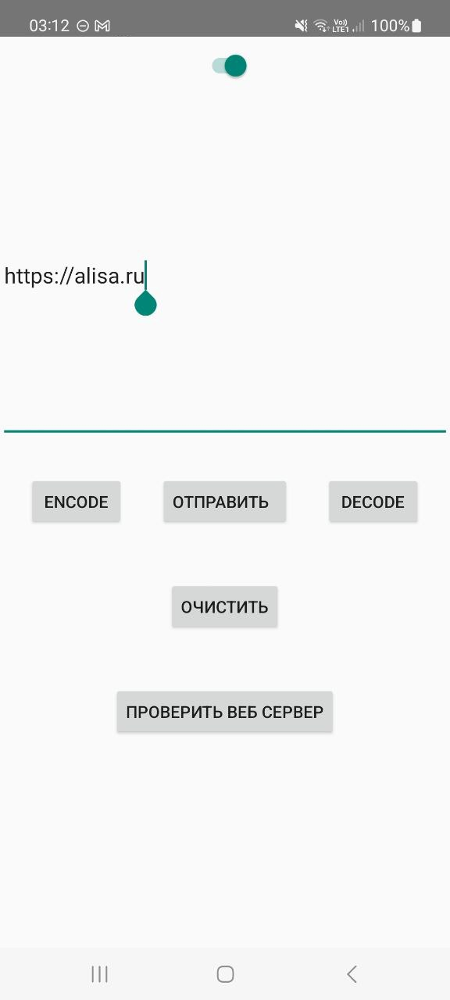

### Обмен ссылками между телефоном и компом в локальной сети

Компоненты для компа - https://github.com/VadimLofitsky/komptube

Приложение
- запускает сервер на основе NanoHTTPD и слушает входящие запросы с компа;
при получении запроса на открытие присланной ссылки выводит её адрес в уведомлении; при нажатии на уведомление ссылка открывается
- может принимать ссылки из браузера при выполнении "Поделиться..."
- может отправлять ссылки, введённые в поле ввода

